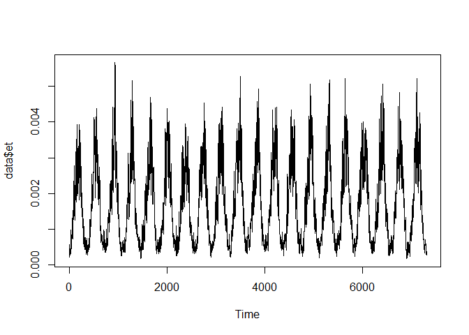
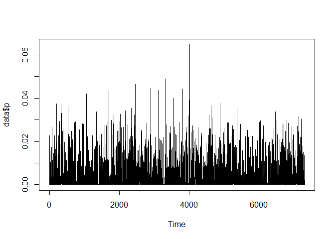
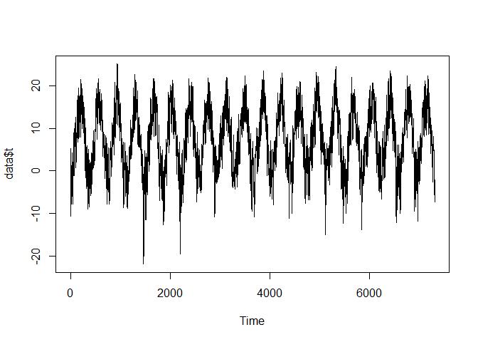
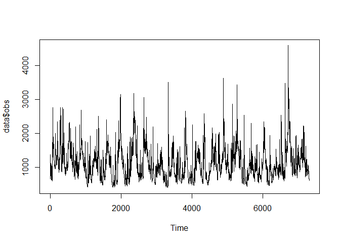
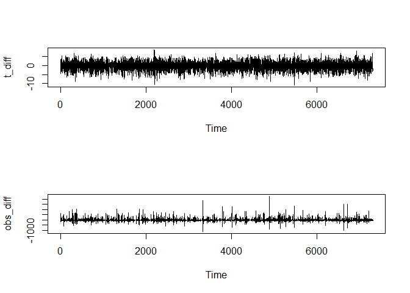
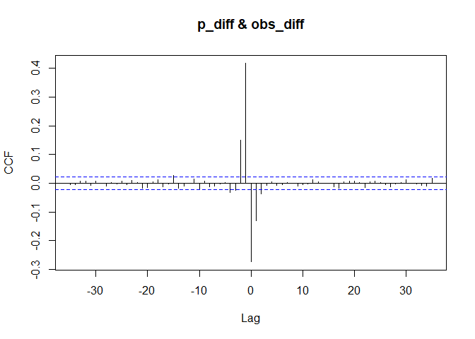

Proper length of sequence to feed to LSTM model
================

### loading the required libraries

``` r
library("httr")
```

    ## Warning: package 'httr' was built under R version 4.1.3

``` r
library('dplyr')
```

    ## 
    ## Attaching package: 'dplyr'

    ## The following objects are masked from 'package:stats':
    ## 
    ##     filter, lag

    ## The following objects are masked from 'package:base':
    ## 
    ##     intersect, setdiff, setequal, union

``` r
library('ggplot2')
library('jsonlite')
```

    ## Warning: package 'jsonlite' was built under R version 4.1.3

``` r
library("fpp3")
```

    ## -- Attaching packages -------------------------------------------- fpp3 0.4.0 --

    ## v tibble      3.1.6     v tsibbledata 0.4.0
    ## v tidyr       1.1.4     v feasts      0.2.2
    ## v lubridate   1.8.0     v fable       0.3.1
    ## v tsibble     1.1.1

    ## -- Conflicts ------------------------------------------------- fpp3_conflicts --
    ## x lubridate::date()    masks base::date()
    ## x dplyr::filter()      masks stats::filter()
    ## x tsibble::intersect() masks base::intersect()
    ## x tsibble::interval()  masks lubridate::interval()
    ## x dplyr::lag()         masks stats::lag()
    ## x tsibble::setdiff()   masks base::setdiff()
    ## x tsibble::union()     masks base::union()

``` r
library('forecast')
```

    ## Registered S3 method overwritten by 'quantmod':
    ##   method            from
    ##   as.zoo.data.frame zoo

``` r
library("tseries")
library(tsibble)
```

### reading dataset

``` r
data = read.csv("basel.csv")
tail(data)
```

    ##         X   datetime           et            p         t     obs
    ## 7300 7299 2000-12-26 0.0004836009 0.0035999021  1.889685 684.333
    ## 7301 7300 2000-12-27 0.0004920696 0.0012419608  2.119268 662.035
    ## 7302 7301 2000-12-28 0.0004127872 0.0005607327 -0.594725 656.253
    ## 7303 7302 2000-12-29 0.0003478145 0.0020267921 -3.251007 652.150
    ## 7304 7303 2000-12-30 0.0003059446 0.0007413164 -5.414832 641.549
    ## 7305 7304 2000-12-31 0.0002736415 0.0000000000 -7.274929 599.663

### Visualizing predictors

``` r
# Visualizing evapotranspiration
ts.plot(data$et)
```

<!-- -->

``` r
# Visualizing precipitation
ts.plot(data$p)
```

<!-- -->

``` r
# Visualizing temperature
ts.plot(data$t)
```

<!-- -->

### Visualizing outcome

``` r
# Visualizing discharge
ts.plot(data$obs)
```

<!-- -->

# Selecting an appropriate lag for predictors

In the absence of a theoretical reason, we can get some idea of what lag
might be appropriate by using descriptive such as the cross-correlation
function (CCF). The CCF is like the bivariate version of the ACF
(auto-correlation function): Instead of looking at the correlation
between X and lagged versions of X, the cross-correlation function
encodes the lagged correlation between X and Y. To compute a meaningful
cross-correlation coefficient, however, it is first necessary to obtain
a stationary time series.

``` r
# differencing the data
t_diff <- diff(data$t, lag=1)
obs_diff <- diff(data$obs, lag = 1)

# checking the stationarity with Dickey-Fuller Test
adf.test(t_diff)
```

    ## Warning in adf.test(t_diff): p-value smaller than printed p-value

    ## 
    ##  Augmented Dickey-Fuller Test
    ## 
    ## data:  t_diff
    ## Dickey-Fuller = -25.828, Lag order = 19, p-value = 0.01
    ## alternative hypothesis: stationary

``` r
# checking the stationarity with Dickey-Fuller Test
adf.test(obs_diff)
```

    ## Warning in adf.test(obs_diff): p-value smaller than printed p-value

    ## 
    ##  Augmented Dickey-Fuller Test
    ## 
    ## data:  obs_diff
    ## Dickey-Fuller = -23.684, Lag order = 19, p-value = 0.01
    ## alternative hypothesis: stationary

``` r
# checking the stationarity with visualizing
par(mfrow=c(2,1))
ts.plot(t_diff); ts.plot(obs_diff)
```

<!-- -->

``` r
# ccf plot to fing the meaningful lagged variable

ccf(t_diff, obs_diff, 100 , ylab = "CCF")
```

<!-- -->

``` r
# according to the plot up until lag 50 for t variable can be included
```

``` r
# ccf plot to fing the meaningful lagged variable
p_diff <- diff(data$p, lag=1)

ccf(p_diff,obs_diff, ylab ="CCF")
```

<!-- -->

``` r
# according to plot up until lag 15 for p variable can be included 
```

``` r
# ccf plot to fing the meaningful lagged variable 
et_diff <- diff(data$p, lag=1)

ccf(et_diff,obs_diff, ylab ="CCF")
```

<!-- -->

``` r
# according to plot  up until lag 15 for et variable can be included 
```
